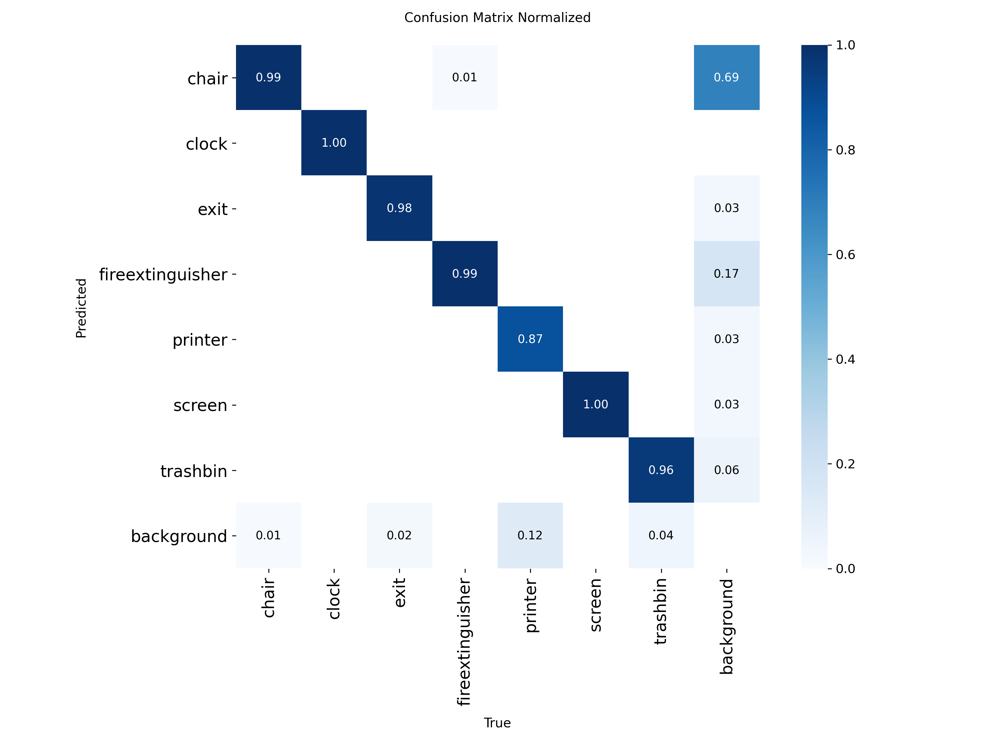

# Indoor Object Detection — YOLO11

Detecting seven classes of indoor objects (chair, clock, exit sign, fire
extinguisher, printer, screen, trash bin) with YOLO11, trained end-to-end
from the raw dlib annotations through to evaluation and error analysis.

- **Dataset:** [Indoor Object Detection Dataset](https://zenodo.org/records/2654485) — 6 recorded sequences, 2,213 images, 4,594 boxes, 7 classes
- **Model:** YOLO11m (Ultralytics), 100 epochs, 640px, AMP, seed 42, deterministic
- **Reproduce in Colab:** `notebooks/colab_submission.ipynb` — clone, install, download data, train, evaluate, visualize
- **Results:** `reports/metrics_table.md` · trained weights in `models/` · good/bad examples in `reports/figures/`

## Pipeline

```
raw dlib XML  ──convert──►  COCO + YOLO labels  ──split──►  train / val / test  ──train──►  YOLO11m  ──evaluate──►  metrics + figures
```

1. **`data_preprocessing/convert.py`** — parses the dlib XML, clamps boxes to
   image bounds, drops degenerate (<1px) boxes, and exports both COCO and YOLO
   formats plus a flattened image directory.
2. **`data_preprocessing/split.py`** — multilabel-stratified 80/10/10 split,
   with a per-class check that prints instance counts per split so every class
   is confirmed present in train, val, and test.
3. **`modeling/train_yolo.py`** — training + evaluation. Includes a CUDA
   smoke-test so the run fails fast with a clear message on a broken GPU build.
4. **`metric.py`** — writes the per-class results table.
5. **`plot.py`** — ranks every image by TP / (TP + FP + FN) and renders the
   k best and k worst (green = prediction, red = ground truth).

## Data

| Class | Boxes |
|---|---:|
| fireextinguisher | 1,684 |
| chair | 1,661 |
| exit | 545 |
| clock | 280 |
| trashbin | 228 |
| screen | 115 |
| printer | 81 |

The class distribution is heavily imbalanced (fireextinguisher/chair make up
~73% of boxes; printer/screen/trashbin are rare), which is the main driver of
the per-class results below.

## Split

The 80/10/10 split is stratified on class presence using
`MultilabelStratifiedShuffleSplit`, since images carry multiple labels and the
rare classes would otherwise be unevenly distributed. `verify_splits` prints
per-class instance counts for each split, confirming all seven classes appear
in train, val, and test as required.

## Results (val / test, mAP@0.5:0.95)

| Class | Boxes | val | test |
|---|---:|---:|---:|
| chair | 1,661 | 0.875 | 0.882 |
| clock | 280 | 0.888 | 0.830 |
| exit | 545 | 0.860 | 0.837 |
| fireextinguisher | 1,684 | 0.863 | 0.844 |
| printer | 81 | 0.741 | 0.878 |
| screen | 115 | 0.842 | 0.914 |
| trashbin | 228 | 0.697 | 0.889 |
| **Overall mAP@0.5** | | **0.988** | **0.993** |
| **Overall mAP@0.5:0.95** | | **0.824** | **0.868** |

Reading: the lowest-AP classes (printer, trashbin) are exactly the rarest, and
their per-class AP swings widely between val and test — expected, since each
holds only ~8–20 boxes per split, so a single miss moves the number a lot.

Result visualizations (validation split)

Confusion matrix (row-normalized). Strong diagonal across all seven classes;
the main off-diagonal mass is the background column — i.e. missed detections and
spurious boxes — and it is heaviest for the rare classes (printer, trashbin),
consistent with their lower AP.



Best / worst examples (green = prediction, red = ground truth), ranked by
per-image TP / (TP + FP + FN):

<table>
<tr>
<td><br><sub>Best — score 1.00<br>clock, exit score 1.00 tp 2 fp 0 fn 0</sub></td>
<td><br><sub>Best — score 1.00<br>clock, exit, fireextinguisher score 1.00 tp 4 fp 0 fn 0</sub></td>
</tr>
<tr>
<td><br><sub>Worst — score 0.25<br>chair score 0.25 tp 1 fp 3 fn 0</sub></td>
<td><br><sub>Worst — score 0.33<br>chair, screen score 0.33 tp 1 fp 1 fn 1</sub></td>
</tr>
<tr>
<td><br><sub>Worst — score 0.25<br>trashbin score 0.00 tp 0 fp 1 fn 0</sub></td>
</tr>
</table>
Full sets (4 best + 4 worst, plus raw confusion matrices) are in
reports/figures/val_examples/. The test-split equivalents — confusion
matrix, PR curve, and best/worst examples — are in
reports/yolo_runs/yolo11m_indoor_test/ and reports/figures/test_examples/.

## Reproduce

**Colab (recommended):** open `notebooks/colab_submission.ipynb` and Run all.

## Error analysis

Ranking every validation/test image by TP / (TP + FP + FN) surfaces not only
where the model fails, but where the *labels* do. Three patterns stand out.

**1. Some "failures" are missing labels, not model errors.** Among the
lowest-scoring test frames, `frame_s2_18` shows the model correctly boxing a
trash bin (`trashbin 0.67`) that is a trash bin, but the frame carries
no ground-truth annotation for it, so the detection is counted as a false
positive and the image scores 0.00. This is annotation sparsity, which is common
in frame-by-frame video labelling. The practical consequence: the reported mAP
is effectively a **lower bound**, the model is penalised for finding real
objects the annotators skipped, and this hits the rare classes (trashbin,
printer) hardest, since each unlabelled instance moves their AP the most.

*To reproduce the label-gap check: after running the pipeline, open the YOLO
label file for a zero-scoring frame, e.g.
`data/processed/yolo/labels/test/frame_s2_18.txt`; an empty file or one with no
trashbin row confirms the missing annotation.*

## Limitations & next steps

- **Leakage-aware evaluation (planned):** the six sequences are video, so
  consecutive frames are near-duplicates. The current 80/10/10 split is
  frame-level, so near-identical frames can land in both train and val/test —
  the model is partly evaluated on scenes it effectively already saw, which
  inflates mAP and makes the reported numbers optimistic for genuinely unseen
  rooms. Planned improvement: split by *sequence* rather than by frame — either
  a grouped split (whole sequences kept intact across train/val/test) or
  leave-one-sequence-out cross-validation — to measure true generalization. The
  honest number will likely be lower, and that is the point.
- **Rare classes:** printer/screen/trashbin have too few boxes for stable
  per-class mAP; those figures are indicative rather than precise. Class-weighted
  loss or targeted oversampling would help.
- **Single model, single config:** YOLO11m with Ultralytics defaults, no
  hyperparameter search. The data is already exported in COCO as well, so an
  RT-DETR comparison for a speed/accuracy trade-off is a straightforward
  follow-up.
- **Inference:** add a `modeling/predict.py` entrypoint (and optionally a small
  Gradio demo) to run detection on arbitrary images.

## Project structure

```
object_detection/
├── config.py                     # paths, ratios, seed, run name
├── configs/
│   └── train_yolo.yaml           # arch/epochs/imgsz/batch
├── data_preprocessing/
│   ├── convert.py                # dlib XML -> COCO + YOLO
│   └── split.py                  # multilabel-stratified 80/10/10 split
├── modeling/
│   └── train_yolo.py             # train + evaluate
├── metric.py                     # per-class results table
└── plot.py                       # best/worst example rendering
models/                           # trained weights (yolo11m_indoor_best.pt)
reports/                          # metrics, figures, ultralytics run artifacts
notebooks/colab_submission.ipynb  # end-to-end Colab reproduction
```